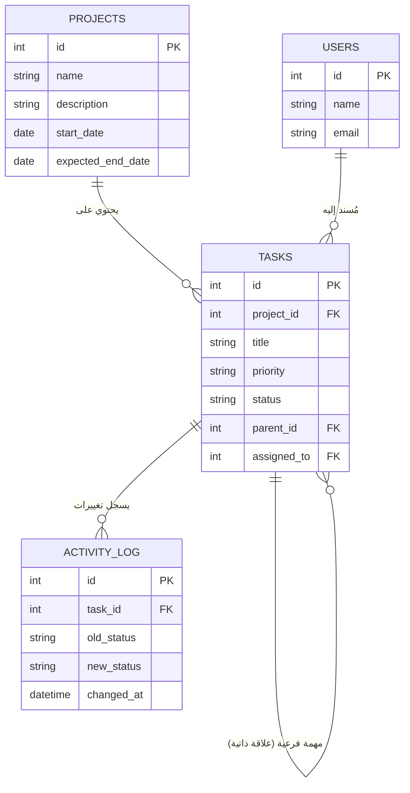

# 🚀 TaskFlow - نظام إدارة المشاريع والمهام

تطبيق ويب مبسط يحاكي دورة حياة تطوير البرمجيات ونظام إدارة المهام (Kanban Board)، مُطور باستخدام Node.js وExpress وقاعدة بيانات SQLite[cite: 1].

---

## 📌 معلومات المشروع
* **المادة:** إدارة المشاريع البرمجية (الفصل الصيفي 2026)[cite: 1].
* **إشراف:** د. عبد الجبار العباس & أ. أحمد صالح[cite: 1].
* **الفرع الحالي:** `feature/project-management` (هيكلة المشروع وإدارة المشاريع).

---

## 🛠 التقنيات المستخدمة
* **بيئة التشغيل:** Node.js (v24.20.0).
* **إطار العمل الخلفي:** Express.js.
* **قاعدة البيانات:** SQLite3 (`taskflow.db`).
* **الواجهة الأمامية:** HTML5, CSS3, JavaScript (Vanilla).
* **إدارة الإصدارات:** Git & GitHub Flow[cite: 1].

---

## 🗄️ هيكل قاعدة البيانات (ERD)



---

## ⚙️ متطلبات وطريقة التشغيل المحلي

### 1. تثبيت الحزم والمكتبات
```bash
npm install
```

### 2. تشغيل الخادم
```bash
node server.js
```
يعمل الخادم محلياً على الرابط: `http://localhost:3000`

---

## 🌳 منهجية Git المتبعة في الفريق
* فرع `main`: الإصدار الرئيسي المستقر والنهائي للمشروع[cite: 1].
* فرع `dev`: الفرع التجميعي لجميع الميزات المكتملة[cite: 1].
* فروع الميزات `feature/*`: فرع مستقل لكل عضو حسب الميزة المسندة إليه[cite: 1].
* الالتزام الصارم بإنشاء **Pull Requests** وإجراء **Code Review** قبل الدمج[cite: 1].
<!DOCTYPE html>
<html lang="ar" dir="rtl">

<head>
    <meta charset="UTF-8">
    <meta name="viewport" content="width=device-width, initial-scale=1.0">

    <title>توزيع المهام والمستخدمين</title>
    <style>
        * {
            box-sizing: border-box;
        }
        body {
            margin: 0;
            padding: 30px;
            font-family: Arial, sans-serif;
            background: #f3f4f6;
            color: #1f2937;
        }
        .container {
            max-width: 1000px;
            margin: auto;
        }
        h1 {
            text-align: center;
            margin-bottom: 30px;
        }
        .card {
            background: white;
            padding: 25px;
            border-radius: 12px;
            margin-bottom: 25px;
            box-shadow: 0 2px 10px rgba(0, 0, 0, 0.08);
        }
        label {
            display: block;
            margin-top: 15px;
            margin-bottom: 7px;
            font-weight: bold;
        }
        input,
        select {
            width: 100%;
            padding: 11px;
            border: 1px solid #d1d5db;
            border-radius: 7px;
            font-size: 15px;
        }
        button {
            margin-top: 20px;
            padding: 11px 20px;
            border: 0;
            border-radius: 7px;
            background: #2563eb;
            color: white;
            cursor: pointer;
            font-size: 15px;
        }
        button:hover {
            background: #1d4ed8;
        }
        .delete-btn {
            background: #dc2626;
            margin-right: 10px;
            padding: 7px 12px;
        }
        .delete-btn:hover {
            background: #b91c1c;
        }
        .task {
            padding: 18px 0;
            border-bottom: 1px solid #e5e7eb;
        }
        .task:last-child {
            border-bottom: none;
        }
        .badge {
            display: inline-block;
            background: #e5e7eb;
            padding: 5px 9px;
            margin: 4px;
            border-radius: 6px;
        }
        .success {
            margin-top: 15px;
            color: green;
            font-weight: bold;
        }
        .error {
            margin-top: 15px;
            color: red;
            font-weight: bold;
        }
        .empty {
            color: #6b7280;
            padding: 15px 0;
        }
    </style>
</head>

<body>

<div class="container">
    <h1>توزيع المهام والمستخدمين</h1>

    <!-- ========================================
         إنشاء وإسناد مهمة
    ========================================= -->

    <div class="card">

        <h2>إسناد مهمة لعضو الفريق</h2>

        <label for="taskTitle">
            اسم المهمة
        </label>

        <input
            id="taskTitle"
            type="text"
            placeholder="اكتب اسم المهمة"
        >

        <!-- المهمة الرئيسية / الفرعية -->

        <label for="taskType">
            نوع المهمة
        </label>

        <select id="taskType">
            <option value="task">
                مهمة رئيسية
            </option>

            <option value="subtask">
                مهمة فرعية
            </option>
        </select>

        <!-- Dropdown List -->

        <label for="assignedUser">
            إسناد المهمة إلى
        </label>

        <select id="assignedUser">
            <option value="">
                -- اختر عضو الفريق --
            </option>
        </select>

        <button id="assignButton">
            إسناد المهمة
        </button>

        <div id="message"></div>

    </div>

    <!-- ========================================
         صلاحيات العرض
    ========================================= -->

    <div class="card">

        <h2>المهام المسندة</h2>

        <label for="viewUser">
            عرض المهام حسب المستخدم
        </label>

        <select id="viewUser">
            <option value="all">
                جميع المهام
            </option>
        </select>

        <div id="taskList"></div>

    </div>

</div>

<script>

/*
====================================================
1. قائمة أعضاء الفريق
====================================================
في المشروع الحقيقي تأتي هذه البيانات من قاعدة البيانات.
*/

const users = [

    {
        id: 1,
        name: "أحمد",
        active: true
    },

    {
        id: 2,
        name: "محمد",
        active: true
    },

    {
        id: 3,
        name: "علي",
        active: true
    },

    {
        id: 4,
        name: "حسين",
        active: true
    },

    {
        id: 5,
        name: "سارة",
        active: true
    }

];


/*
====================================================
2. تحميل المهام المحفوظة
====================================================
نستخدم localStorage حتى لا تختفي المهام
بعد تحديث الصفحة.
*/

let tasks = JSON.parse(
    localStorage.getItem("taskFlowAssignments")
) || [];


/*
====================================================
3. عناصر الصفحة
====================================================
*/

const taskTitle =
    document.getElementById("taskTitle");

const taskType =
    document.getElementById("taskType");

const assignedUser =
    document.getElementById("assignedUser");

const viewUser =
    document.getElementById("viewUser");

const taskList =
    document.getElementById("taskList");

const message =
    document.getElementById("message");

const assignButton =
    document.getElementById("assignButton");


/*
====================================================