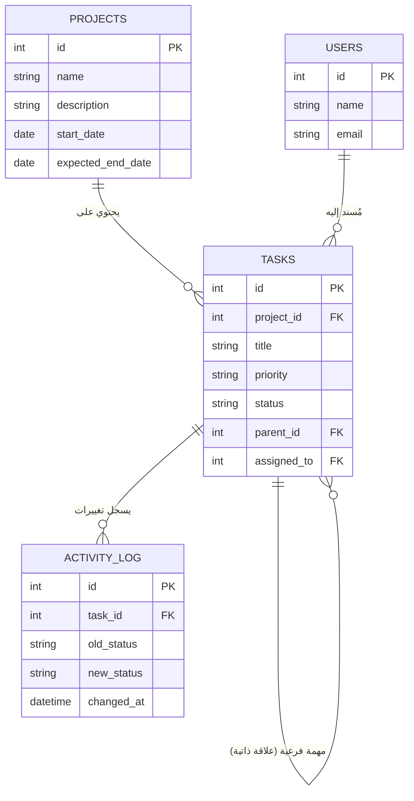

# 🚀 TaskFlow - نظام إدارة المشاريع والمهام

تطبيق ويب مبسط يحاكي دورة حياة تطوير البرمجيات ونظام إدارة المهام (Kanban Board)، مُطور باستخدام Node.js وExpress وقاعدة بيانات SQLite[cite: 1].

---

## 📌 معلومات المشروع
* **المادة:** إدارة المشاريع البرمجية (الفصل الصيفي 2026)[cite: 1].
* **إشراف:** د. عبد الجبار العباس & أ. أحمد صالح[cite: 1].
* **الفرع الحالي:** `feature/project-management` (هيكلة المشروع وإدارة المشاريع).

---

## 🛠 التقنيات المستخدمة
* **بيئة التشغيل:** Node.js (v24.20.0).
* **إطار العمل الخلفي:** Express.js.
* **قاعدة البيانات:** SQLite3 (`taskflow.db`).
* **الواجهة الأمامية:** HTML5, CSS3, JavaScript (Vanilla).
* **إدارة الإصدارات:** Git & GitHub Flow[cite: 1].

---

## 🗄️ هيكل قاعدة البيانات (ERD)



---

## ⚙️ متطلبات وطريقة التشغيل المحلي

### 1. تثبيت الحزم والمكتبات
```bash
npm install
```

### 2. تشغيل الخادم
```bash
node server.js
```
يعمل الخادم محلياً على الرابط: `http://localhost:3000`

---

## 🌳 منهجية Git المتبعة في الفريق
* فرع `main`: الإصدار الرئيسي المستقر والنهائي للمشروع[cite: 1].
* فرع `dev`: الفرع التجميعي لجميع الميزات المكتملة[cite: 1].
* فروع الميزات `feature/*`: فرع مستقل لكل عضو حسب الميزة المسندة إليه[cite: 1].
* الالتزام الصارم بإنشاء **Pull Requests** وإجراء **Code Review** قبل الدمج[cite: 1].